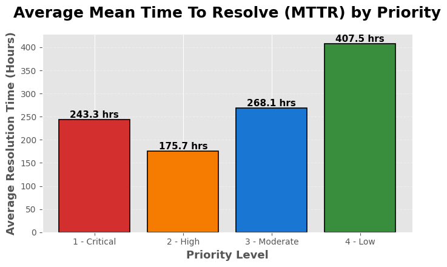
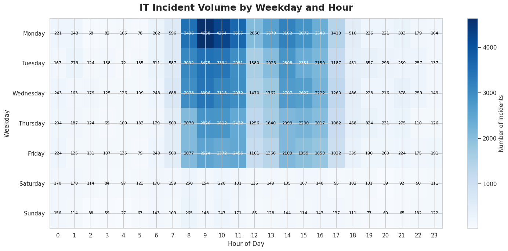
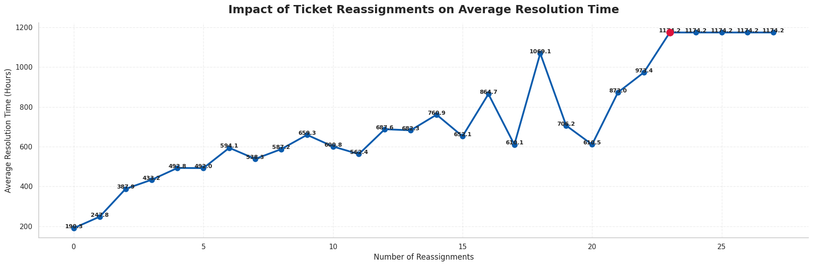
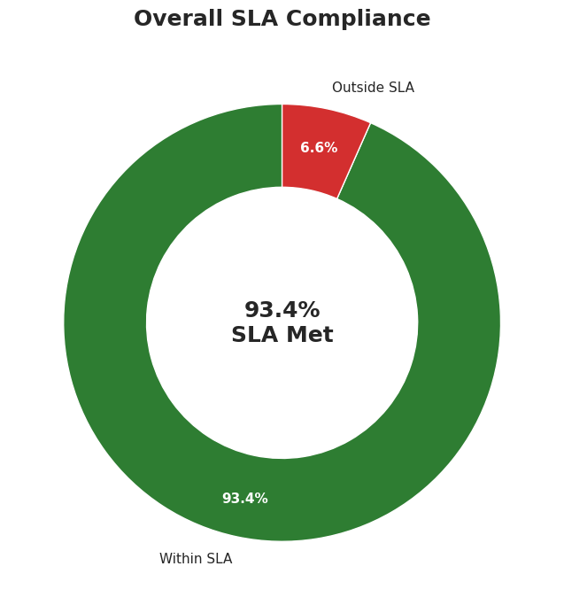

# IT Incident Log Data Analysis

## Project Overview

This project analyzes an IT Service Management (ITSM) incident log dataset to uncover operational trends, evaluate Service Level Agreement (SLA) performance, and identify opportunities to improve incident management processes. Using Python for data cleaning, analysis, and visualization, the project transforms raw incident records into actionable business insights that support faster issue resolution and more efficient IT service operations.

---

## Business Problem

IT support teams handle thousands of incidents every month. Without proper analysis, it becomes difficult to identify recurring issues, monitor SLA compliance, allocate resources efficiently, and improve overall service quality.

This project addresses these challenges by analyzing historical incident data to answer key operational questions and provide data-driven recommendations for improving IT service management.

---

## Project Objectives

* Analyze incident trends over time.
* Measure SLA compliance and breach rates.
* Identify high-volume incident categories.
* Evaluate assignment group workloads.
* Compare Mean Time to Resolve (MTTR) across priorities.
* Discover recurring incident types suitable for permanent fixes.
* Generate actionable business insights through data visualization.

---

## Dataset

The dataset contains historical IT incident records with information such as:

* Incident Number
* Category
* Priority
* Assignment Group
* Opened Date & Time
* Resolved Date & Time
* Incident State
* SLA Status
* Reassignment Count
* Resolution Information

---

## Technologies Used

| Category                | Tools         |
| ----------------------- | ------------- |
| Programming             | Python        |
| Data Analysis           | Pandas, NumPy |
| Visualization           | Matplotlib    |
| Development Environment | Google Colab  |
| Version Control         | Git & GitHub  |

---

# Project Workflow

```text
                    IT Incident Log Dataset
                              │
                              ▼
                    Data Collection
                              │
                              ▼
                   Data Understanding
        (Shape, Data Types, Missing Values)
                              │
                              ▼
                    Data Preprocessing
      • Handle Missing Values
      • Clean Invalid Entries
      • Convert Datatypes
      • Parse Date & Time
                              │
                              ▼
                    Feature Engineering
      • MTTR Calculation
      • SLA Metrics
      • Hour, Weekday & Month Extraction
                              │
                              ▼
               Exploratory Data Analysis
                              │
                              ▼
                KPI & Business Analysis
                              │
                              ▼
                 Data Visualization
                              │
                              ▼
         Business Insights & Recommendations
```

---

# Project Methodology

### 1. Data Collection

* Loaded the IT incident dataset into Python using Pandas.
* Imported all required libraries for analysis and visualization.

### 2. Data Understanding

* Explored dataset dimensions.
* Inspected data types.
* Examined missing values.
* Identified duplicate records.
* Reviewed descriptive statistics.

### 3. Data Preprocessing

* Replaced invalid entries.
* Handled missing values.
* Converted date columns into datetime format.
* Removed duplicate records.
* Optimized data types.
* Validated timestamp consistency.

### 4. Feature Engineering

Created additional analytical features including:

* Hour of Incident
* Weekday
* Month
* ISO Week
* Mean Time to Resolve (MTTR)
* SLA Compliance Metrics

### 5. Exploratory Data Analysis

Performed detailed analysis on:

* Incident Volume
* Priority Distribution
* Assignment Groups
* Incident Categories
* Incident States
* Time-based Trends

### 6. KPI & Business Analysis

Evaluated important ITSM metrics including:

* SLA Breach Rate
* MTTR by Priority
* Assignment Group Performance
* High-Urgency Incident Trends
* Recurring Incident Categories
* Reassignment Analysis

### 7. Data Visualization

Developed professional business visualizations using Matplotlib including:

* Bar Charts
* Horizontal Bar Charts
* Line Charts
* Pie Charts
* Heatmaps
* Trend Analysis

### 8. Business Insights & Recommendations

Converted analytical findings into practical recommendations to improve:

* SLA Compliance
* Resource Allocation
* Incident Routing
* Resolution Efficiency
* Preventive Maintenance

---

# Key Performance Indicators (KPIs)

This project evaluates the following operational KPIs:

* Total Number of Incidents
* Mean Time to Resolve (MTTR)
* SLA Compliance Rate
* SLA Breach Rate
* High Priority Incident Count
* Top Assignment Groups
* Top Incident Categories
* Incident Volume Trends
* Monthly Incident Distribution

---

# Business Questions Answered

This analysis answers several important business questions, including:

* Which assignment groups receive the highest number of incidents?
* Which priorities have the highest SLA breach rate?
* Which incident categories occur most frequently?
* How does MTTR vary by priority?
* During which hours are incidents most common?
* Which weekdays experience the highest workload?
* Which months have the highest incident volume?
* What are the top recurring incident categories that should be targeted for permanent fixes?

---

# Key Insights

Some of the major insights generated include:

* Identification of high-workload assignment groups.
* Detection of categories generating the highest number of incidents.
* Measurement of SLA compliance across different priorities.
* Analysis of incident trends by hour, weekday, and month.
* Identification of recurring incidents contributing to operational inefficiencies.
* Recognition of process improvement opportunities through MTTR analysis.

---

# Repository Structure

```text
IT-Incident-Log-Data-Analysis/
│
├── Project_on_IT_incident_log_DA.ipynb
├── README.md
└── IT_Incident_Log.csv
```

*(Remove the dataset entry above if the dataset is not included in the repository.)*

---

# Future Improvements

Potential enhancements include:

* Develop an interactive Power BI dashboard.
* Build a predictive model for SLA breach prediction.
* Perform root cause analysis using machine learning.
* Integrate SQL-based data extraction.
* Automate KPI reporting using Python.

---

## Project Visualizations









---

# Author

**Jasmehar Singh**

B.Sc. (Hons.) Mathematics | Aspiring Data Analyst

**Skills:** Python • Pandas • NumPy • Matplotlib • Data Cleaning • Exploratory Data Analysis • Business Analytics • Git • GitHub

